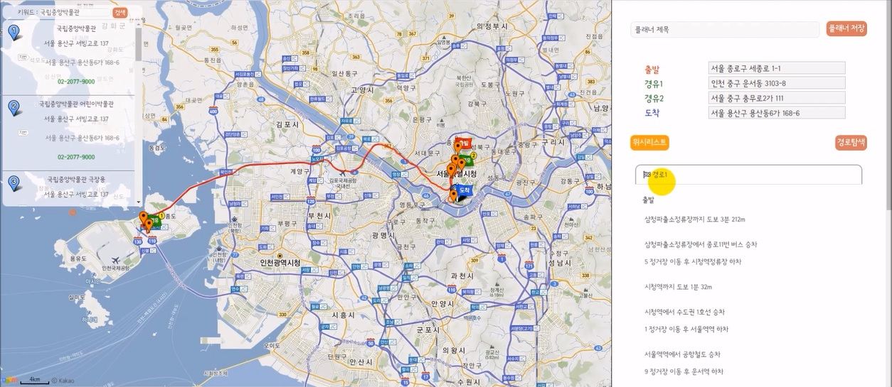

# 나들이 

## 플래너
- 플래너 등록 화면  

> - 지도를 클릭하거나 검색, 위시리스트에 저장된 장소를 출발지, 경유지, 도착지로 선택할 수 있음
> - 경유지는 5개까지 선택 가능
> - 경로탐색 버튼을 누르면 경로가 지도에 뿌려지고 우측에서 경로에 대한 대중교통 상세정보를 확인할 수 있음

  
- 플래너 상세조회 화면  

> - 등록화면에서 볼 수 있었던 정보들을 다시 확인 가능 
> - 지도 하단 마커를 클릭하여 해당 경로를 지도에서 포커싱해 볼 수 있음

  
## 모임게시판
- 게시글 상세조회 화면  

> - 글 작성 시 등록한 장소를 지도에 출력해서 보여줌
> - 해당 모임에 대한 참여/취소, 좋아요 등록/취소, 댓글 등록/수정/삭제 가능(ajax)
> - 글 작성자나 모임 참여자의 아이디를 클릭하여 쪽지보내기 가능

  
- 게시글 목록 화면  

> - 각 게시글에 해당하는 장소의 이름을 네이버 이미지검색 API로 보내 이미지를 받아와 목록에서 출력 
